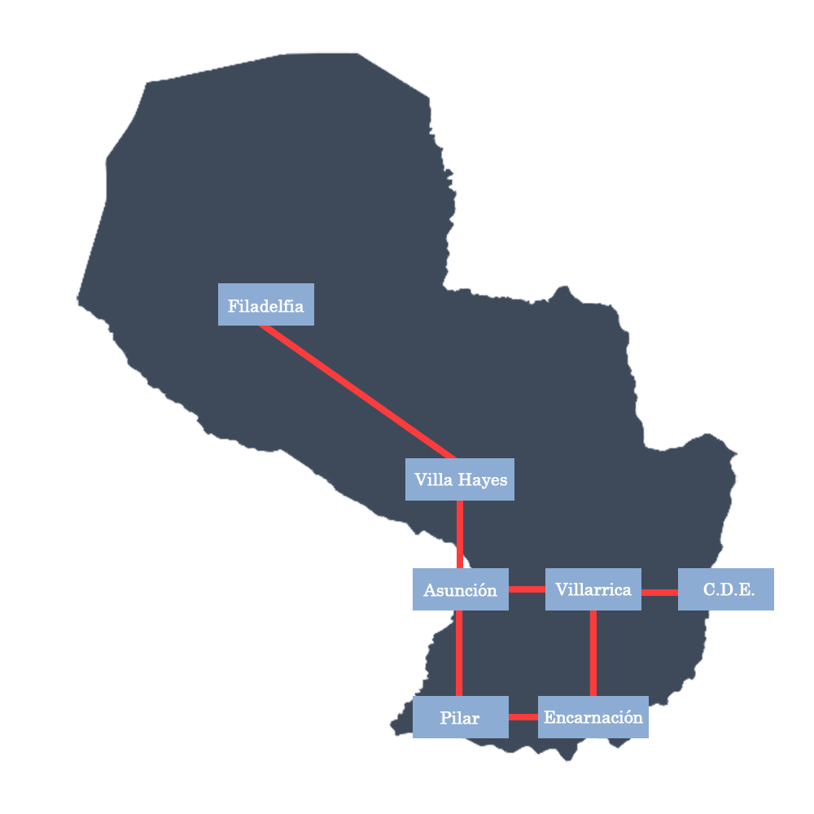

# Parawhy

## Historia

Eres el honorable senador Fulano De Tal y aspiras a seguir ascendiendo en el
escalafón político asunceno. Confías en que tu estrecha relación con el excelentísimo
presidente Sebastián Peña dará frutos en la forma de algún título ministerial. Sin
embargo, los favores son la moneda política por excelencia, por lo que deberás recorrer
el país haciendo algunos recados administrativos sin importancia antes de poder contar
con el patrocinio del presidente.
Tu aventura comienza en la ciudad de Villarrica, a partir de allí podrás viajar a
algunas de las ciudades más emblemáticas del país (Asunción, Encarnación, Ciudad del
Este, Pilar) y, además, visitar sus puntos de interés. Te encontrarás con personajes que
harán tu trayecto más entretenido (y desafiante).
Tu último recado será en el Chaco, por lo que deberás ir preparado con los
objetos que hayas podido llevar de la región oriental. Se supone que, al finalizar esta
tarea, el presidente te dará el anhelado cargo de ministro, pero un inesperado giro en los
acontecimientos le da fin a la historia del juego.

## Mapa

## ¿Cómo jugar?

Clona este repositorio en tu sistema y ejecuta el archivo src/JugarJuego.java.
**IMPORTANTE**: el juego debe ejecutarse con codificación o encoding _ISO-8859-9_ para su
correcto funcionamiento.

## Créditos

Este juego fue desarrollado como proyecto para la materia Introducción a la Programación II
de la Universidad Nacional de Itapúa basado en el código original del juego _Zork_ de Michael
Kolling de la Universidad de Monash.
